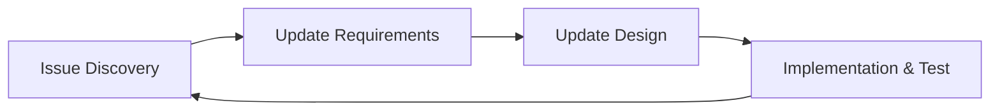

# CLOSM Probe Development Guidelines

**Last Updated**: 2026-02-05

---

## Development Methodology: Agile

このプロジェクトはアジャイル方式で開発を進めます。

### Iteration Cycle



| Step | Actions |
|------|---------|
| 1. Issue Discovery | 動作確認、問題点特定 |
| 2. Update Requirements | `docs/requirements/` 更新、`/doc-standards` 適用 |
| 3. Update Design | `docs/design/` 更新、`/doc-standards` 適用、影響範囲特定 |
| 4. Implementation & Test | コード変更、`cargo check`、ユーザーが `cargo run` |

### Key Skills for Agile

| Skill | Purpose |
|-------|---------|
| `/doc-standards` | Documentation quality, structure, token efficiency |
| `/kawamoto-project` | Cross-project development rules and best practices |
| `/rust-skills:*` | Rust-specific patterns and crate documentation |

---

## Project Overview

**CLOSM Probe**: 3D storage visualization tool using universe metaphor.

| Item | Value |
|------|-------|
| Status | **Iteration 1** - Core functionality refinement |
| Language | Rust (Edition 2024) |
| Engine | Bevy 0.15 |

### Core Metaphor

| Storage | Universe |
|---------|----------|
| Current folder | Star (center) |
| Child folder | Planet (sphere) |
| Child file | Planet (octahedron) |
| Grandchild | Ring around planet |

---

## Tech Stack

```toml
[dependencies]
bevy = "0.15"                    # ECS game engine
bevy_egui = "0.31"               # UI overlay
bevy_panorbit_camera = "0.22"    # Orbital camera
bevy_hanabi = "0.14"             # GPU particles
rfd = "0.15"                     # File dialog
dark-light = "1.0"               # OS theme detection
```

---

## Absolute Rules

| Rule | Description |
|------|-------------|
| **No Auto-Commit** | Never commit without explicit instruction |
| **No Auto-Run** | Never `cargo run` without instruction. `cargo check` is OK |
| **English Docs** | Documentation in English, conversation in Japanese |
| **Metaphor Sync** | Visual changes must align with `docs/requirements/metaphor.md` |
| **Doc Standards** | ALL documentation (`docs/requirements/`, `docs/design/`) MUST follow `/doc-standards` principles |

---

## Module Structure

```
src/
├── main.rs           # App entry, plugin registration
├── states.rs         # Application state machine
├── events.rs         # Application events
├── bundles.rs        # Entity bundles
├── components/       # ECS components
├── resources/        # ECS resources
├── systems/          # ECS systems
└── utils/            # Utility functions
```

**Details**: See `docs/design/ecs-architecture.md` for component/resource/system specifications.

---

## Documentation Structure

```
docs/
├── requirements/          # Product requirements
├── design/                # Technical design
└── reference/             # Implementation references
```

**Navigation**: Start from `docs/requirements/index.md` or `docs/design/index.md`.

---

## Development Process

```
1. Read relevant design docs first
2. Implement incrementally
3. cargo check frequently
4. Wait for user to test (cargo run)
5. Wait for commit instruction
```

### Documentation Updates

**CRITICAL**: When updating `docs/requirements/` or `docs/design/`:

1. **Always apply `/doc-standards`** - Token efficiency, clear structure, no ambiguity
2. **Follow agile iteration cycle** - Update requirements → Update design → Implement
3. **Maintain consistency** - All docs must reflect current implementation

### Key Design Documents

| When | Read |
|------|------|
| Adding visual features | `docs/requirements/visual.md` |
| Changing metaphor | `docs/requirements/metaphor.md` |
| Modifying ECS | `docs/design/ecs-architecture.md` |
| Camera changes | `docs/design/camera.md` |
| UI changes | `docs/design/ui.md` |

---

## Bevy 0.15 Quick Reference

### Entity Spawning

```rust
commands.spawn((
    Mesh3d(meshes.add(Sphere::new(1.0))),
    MeshMaterial3d(materials.add(StandardMaterial { /* ... */ })),
    Transform::from_xyz(0.0, 0.0, 0.0),
));
```

### State Machine

```rust
#[derive(States, Default, Clone, Eq, PartialEq, Hash, Debug)]
pub enum AppState { #[default] Empty, Loading, Viewing }
```

### Critical: rfd File Dialog

**NEVER open at startup** - blocks event loop. Use button click trigger only.

**More patterns**: See `docs/reference/bevy-notes.md`.

---

## Commands

```bash
cargo check          # Quick syntax check (allowed anytime)
cargo run            # Run application (wait for instruction)
cargo clippy         # Lint check
cargo fmt            # Format code
```

---

## rust-skills Reference

| Use Case | Skill |
|----------|-------|
| Type-driven design | `/rust-skills:m05-type-driven` |
| Domain modeling | `/rust-skills:m09-domain` |
| Performance | `/rust-skills:m10-performance` |
| Lifecycle/RAII | `/rust-skills:m12-lifecycle` |
| Error handling | `/rust-skills:m13-domain-error` |
| Anti-patterns | `/rust-skills:m15-anti-pattern` |
| Unsafe code | `/rust-skills:unsafe-checker` |
| Crate docs | `/rust-skills:docs {crate_name}` |

---

## Cross-Session Memory (claude-mem)

**MCP Tools**: `search()`, `timeline()`, `get_observations()` available for past decisions/implementations.

**Types**: discovery, change, decision, bugfix, feature

---

## Visual Encoding Quick Reference

| Property | Rule |
|----------|------|
| **Size** | Star: 2.5, Directory: 0.5-2.0, File: 0.3-1.8 (log10 scale) |
| **Color** | Code→Cyan, Image→Orange, Video→Red, Doc→Blue, Data→Teal, Archive→Gray |
| **Brightness** | 100% (<24h) → 25% (>1yr) based on modification time |

**Full specification**: See `docs/requirements/visual.md`.

---

## Current Iteration: Issues

**Iteration 1 Issues** (2026-02-05):

| # | Issue | Priority |
|---|-------|----------|
| 1 | Path navigation breaks 3D display (never re-renders after drilldown) | P0 |
| 2 | Sidebar should be on left side (like Claude/ChatGPT) | P1 |
| 3 | Sidebar UI needs modern chat-style redesign | P1 |
| 4 | No view/directory selection feature in UI | P1 |

### Testing Checklist

| Test | Status |
|------|--------|
| Startup → Empty universe + "Open Folder" | ✅ |
| Select folder → Celestials spawn | ✅ |
| Hover → Tooltip | ✅ |
| Click → Selection | ⚠️ Needs verification |
| Double-click → Drilldown | ❌ Broken (Issue #1) |
| Breadcrumb → Navigate | ❌ Broken (Issue #1) |
| Space → Reset view | ⚠️ Needs verification |
| Esc → Clear selection | ⚠️ Needs verification |
