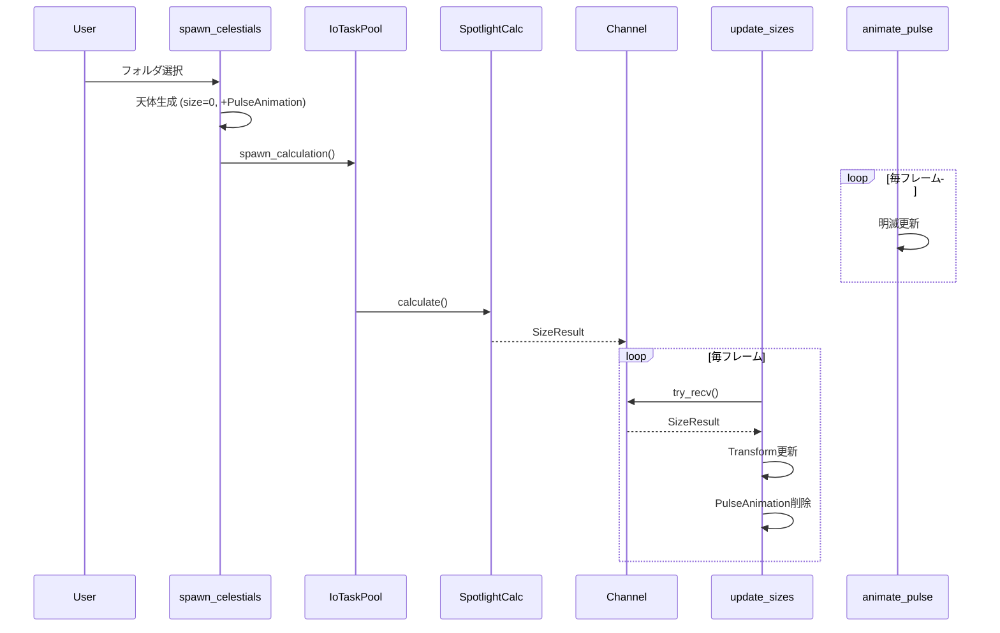

[← UI](./ui.md) | [Index](./index.md)

# Size Calculation Design

ディレクトリサイズ計算のシステム設計。

---

## Module Structure

```
src/
├── systems/
│   ├── filesystem.rs        # 既存: read_directory
│   └── size_calculation/    # 新規モジュール
│       ├── mod.rs           # SizeCalculator trait
│       ├── spotlight.rs     # macOS実装 #[cfg(target_os = "macos")]
│       └── jwalk.rs         # フォールバック #[cfg(not(target_os = "macos"))]
├── components/
│   └── animation.rs         # 新規: PulseAnimation
└── resources/
    └── size_channel.rs      # 新規: SizeCalculationChannel
```

---

## Trait: SizeCalculator

```rust
// src/systems/size_calculation/mod.rs

pub struct SizeResult {
    pub path: PathBuf,
    pub size: u64,
}

pub trait SizeCalculator: Send + Sync {
    /// 同期計算（テスト用）
    fn calculate(&self, path: &Path) -> u64;

    /// 非同期計算（本番用）
    fn spawn_calculation(
        &self,
        paths: Vec<PathBuf>,
        sender: async_channel::Sender<SizeResult>,
    );
}

/// プラットフォーム別の実装を取得
pub fn get_calculator() -> Box<dyn SizeCalculator> {
    #[cfg(target_os = "macos")]
    { Box::new(SpotlightCalculator) }

    #[cfg(not(target_os = "macos"))]
    { Box::new(JwalkCalculator) }
}
```

---

## Platform: macOS Spotlight

```rust
// src/systems/size_calculation/spotlight.rs

#[cfg(target_os = "macos")]
pub struct SpotlightCalculator;

#[cfg(target_os = "macos")]
impl SizeCalculator for SpotlightCalculator {
    fn calculate(&self, path: &Path) -> u64 {
        // mdfind -onlyin /path "kMDItemFSSize > 0" -attr kMDItemFSSize
        let output = Command::new("mdfind")
            .args(["-onlyin", path.to_str().unwrap()])
            .arg("kMDItemFSSize > 0")
            .arg("-attr")
            .arg("kMDItemFSSize")
            .output();

        // パース: 各行の kMDItemFSSize = N を合計
        parse_spotlight_output(output)
    }

    fn spawn_calculation(&self, paths: Vec<PathBuf>, sender: Sender<SizeResult>) {
        IoTaskPool::get().spawn(async move {
            for path in paths {
                let size = self.calculate(&path);
                let _ = sender.send(SizeResult { path, size }).await;
            }
        }).detach();
    }
}
```

---

## Platform: Fallback (jwalk)

```rust
// src/systems/size_calculation/jwalk.rs

#[cfg(not(target_os = "macos"))]
pub struct JwalkCalculator;

#[cfg(not(target_os = "macos"))]
impl SizeCalculator for JwalkCalculator {
    fn calculate(&self, path: &Path) -> u64 {
        jwalk::WalkDir::new(path)
            .into_iter()
            .filter_map(|e| e.ok())
            .filter(|e| e.file_type().is_file())
            .map(|e| e.metadata().map(|m| m.len()).unwrap_or(0))
            .sum()
    }

    fn spawn_calculation(&self, paths: Vec<PathBuf>, sender: Sender<SizeResult>) {
        IoTaskPool::get().spawn(async move {
            for path in paths {
                let size = self.calculate(&path);
                let _ = sender.send(SizeResult { path, size }).await;
            }
        }).detach();
    }
}
```

---

## Resource: SizeCalculationChannel

```rust
// src/resources/size_channel.rs

use async_channel::{bounded, Receiver, Sender};

#[derive(Resource)]
pub struct SizeCalculationChannel {
    pub sender: Sender<SizeResult>,
    pub receiver: Receiver<SizeResult>,
}

impl Default for SizeCalculationChannel {
    fn default() -> Self {
        let (sender, receiver) = bounded(100);
        Self { sender, receiver }
    }
}
```

---

## Component: PulseAnimation

```rust
// src/components/animation.rs

/// 計算中の明滅アニメーション
#[derive(Component)]
pub struct PulseAnimation {
    pub elapsed: f32,
    pub frequency: f32,  // Hz
    pub min_alpha: f32,
    pub max_alpha: f32,
}

impl Default for PulseAnimation {
    fn default() -> Self {
        Self {
            elapsed: 0.0,
            frequency: 2.0,  // 2Hz = 0.5秒周期
            min_alpha: 0.3,
            max_alpha: 1.0,
        }
    }
}

/// 計算待ちマーカー
#[derive(Component)]
pub struct PendingSizeCalculation;
```

---

## System: spawn_celestials (Modified)

```rust
// 変更点: ディレクトリにPulseAnimation追加

if entry.is_directory {
    let planet_entity = commands.spawn((
        DirectoryPlanetBundle::new(/* ... */),
        PulseAnimation::default(),           // 追加
        PendingSizeCalculation,              // 追加
    )).id();

    // サイズ計算をキュー
    pending_calculations.push(entry.path.clone());
}

// 全ディレクトリの計算を開始
if !pending_calculations.is_empty() {
    let calculator = get_calculator();
    calculator.spawn_calculation(pending_calculations, size_channel.sender.clone());
}
```

---

## System: update_celestial_sizes

```rust
// src/systems/size_calculation/mod.rs

pub fn update_celestial_sizes(
    mut commands: Commands,
    channel: Res<SizeCalculationChannel>,
    mut celestials: Query<(
        Entity,
        &mut CelestialBody,
        &mut Transform,
        &Planet,
    ), With<PendingSizeCalculation>>,
    config: Res<VisualConfig>,
) {
    while let Ok(result) = channel.receiver.try_recv() {
        for (entity, mut body, mut transform, planet) in celestials.iter_mut() {
            if body.path == result.path && planet.is_directory {
                // サイズ更新
                body.size_bytes = result.size;

                // ビジュアルサイズ再計算
                let new_size = calculate_size(result.size, true, &config);
                transform.scale = Vec3::splat(new_size);

                // アニメーション停止
                commands.entity(entity)
                    .remove::<PulseAnimation>()
                    .remove::<PendingSizeCalculation>();

                break;
            }
        }
    }
}
```

---

## System: animate_pulse

```rust
// src/systems/animation.rs

pub fn animate_pulse(
    time: Res<Time>,
    mut query: Query<(&mut PulseAnimation, &MeshMaterial3d<StandardMaterial>)>,
    mut materials: ResMut<Assets<StandardMaterial>>,
) {
    for (mut pulse, material_handle) in query.iter_mut() {
        pulse.elapsed += time.delta_secs();

        // sin波で明滅
        let t = (pulse.elapsed * pulse.frequency * std::f32::consts::TAU).sin();
        let alpha = pulse.min_alpha + (pulse.max_alpha - pulse.min_alpha) * (t * 0.5 + 0.5);

        if let Some(material) = materials.get_mut(&material_handle.0) {
            material.base_color.set_alpha(alpha);
        }
    }
}
```

---

## Registration (main.rs)

```rust
// 追加するリソースとシステム

.init_resource::<SizeCalculationChannel>()

.add_systems(
    Update,
    (
        update_celestial_sizes,
        animate_pulse,
    ).run_if(in_state(AppState::Viewing)),
)
```

---

## Sequence Diagram



---

## Dependencies

```toml
# Cargo.toml

[dependencies]
async-channel = "2.0"

[target.'cfg(not(target_os = "macos"))'.dependencies]
jwalk = "0.8"
```

---

## See Also

- [Size Calculation Requirements](../requirements/size-calculation.md)
- [ECS Architecture](./ecs-architecture.md) - Component/Resource definitions
- [Size Calculation Research](../reference/size-calculation-research.md) - Technical research
