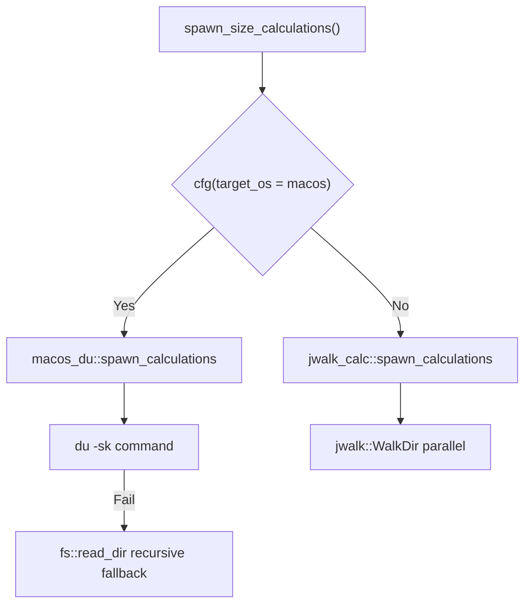
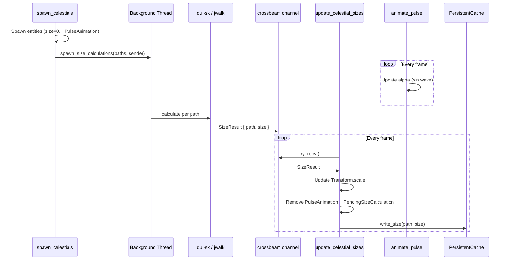

[← UI](./ui.md) | [Index](./index.md)

# Size Calculation Design

Directory size calculation system design.

---

## Module Structure

```
src/systems/size_calculation/
├── mod.rs           # SizeResult, SizeCalculationChannel, systems
├── macos_du.rs      # macOS: du command + fs fallback
└── jwalk_calc.rs    # Other platforms: jwalk parallel traversal
```

---

## Platform Selection



| Platform | Method | Thread | Fallback |
|----------|--------|--------|----------|
| macOS | `du -sk` command | `std::thread::spawn` | `fs::read_dir` recursive |
| Others | `jwalk::WalkDir` | `IoTaskPool` | None |

---

## Core Types

```rust
// src/systems/size_calculation/mod.rs

#[derive(Debug, Clone)]
pub struct SizeResult {
    pub path: PathBuf,
    pub size: u64,
}

#[derive(Resource)]
pub struct SizeCalculationChannel {
    pub sender: Sender<SizeResult>,      // crossbeam_channel
    pub receiver: Receiver<SizeResult>,  // bounded(100)
}
```

---

## Systems

### spawn_size_calculations (called from spawning.rs)

```rust
pub fn spawn_size_calculations(paths: Vec<PathBuf>, sender: Sender<SizeResult>)
```

Dispatches to platform-specific implementation via `#[cfg]`.

### update_celestial_sizes

```rust
pub fn update_celestial_sizes(
    mut commands: Commands,
    channel: Res<SizeCalculationChannel>,
    mut celestials: Query<..., With<PendingSizeCalculation>>,
    config: Res<VisualConfig>,
    persistent_cache: Option<Res<PersistentCache>>,
)
```

| Step | Action |
|------|--------|
| 1 | `channel.receiver.try_recv()` (non-blocking) |
| 2 | Match result path to celestial entity |
| 3 | Update `body.size_bytes` and `transform.scale` |
| 4 | Remove `PulseAnimation` + `PendingSizeCalculation` |
| 5 | Write to `PersistentCache` if available |

### animate_pulse

Sin wave alpha modulation on `MeshMaterial3d<StandardMaterial>`.

| Parameter | Value |
|-----------|-------|
| Frequency | 2 Hz (0.5s cycle) |
| Min alpha | 0.4 |
| Max alpha | 1.0 |

---

## Components

| Component | Purpose |
|-----------|---------|
| `PulseAnimation` | Sin wave alpha animation state (`components/animation.rs`) |
| `PendingSizeCalculation` | Marker: awaiting size result |

---

## Data Flow



---

## Cache Integration

Size calculation integrates with `PersistentCache` (see [persistent-cache.md](./persistent-cache.md)):

| Timing | Action |
|--------|--------|
| Before spawn | `persistent_cache.get_size(path)` — HIT: use cached, no pulse |
| After calculation | `persistent_cache.write_size(path, size)` — non-blocking |

---

## Dependencies

```toml
[dependencies]
crossbeam-channel = "0.5"

[target.'cfg(not(target_os = "macos"))'.dependencies]
jwalk = "0.8"
```

---

## See Also

- [Size Calculation Requirements](../requirements/size-calculation.md)
- [Persistent Cache](./persistent-cache.md) — redb two-tier cache
- [ECS Architecture](./ecs-architecture.md) — Component/Resource definitions
