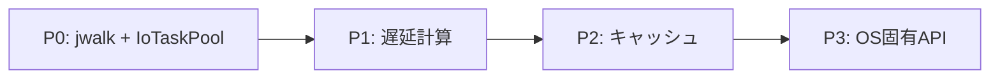

# Directory Size Calculation Research

**Date**: 2026-02-05
**Purpose**: ディレクトリサイズ計算の高速化ベストプラクティス調査結果

---

## Executive Summary

| アプローチ | 高速化倍率 | 難易度 | 推奨Phase |
|-----------|-----------|--------|-----------|
| jwalk並列走査 | 4x | 低 | P0 |
| Bevy IoTaskPool | UIブロック解消 | 中 | P0 |
| 遅延計算（可視のみ） | 計算量削減 | 中 | P1 |
| キャッシュ | 再計算回避 | 低 | P2 |
| OS固有API | 10x+ | 高 | P3 |

---

## 1. 問題の本質

**なぜフォルダサイズはファイルサイズより遅いか**:

| 項目 | ファイル | フォルダ |
|------|----------|----------|
| サイズ取得 | メタデータに保存済み | **事前計算されていない** |
| 計算方法 | `metadata.len()` | 再帰的に全ファイルをスキャン |
| OS対応 | Windows Explorer: サイズ列に表示しない（性能理由） |

Source: [Microsoft Q&A](https://learn.microsoft.com/en-us/answers/questions/3185427/windows-file-explorer-not-showing-folder-size)

---

## 2. jwalk - 並列ディレクトリ走査

**効果**: walkdirの **4倍高速**（ソート済み + メタデータ）

### 特徴

- rayonベースの並列処理
- ディレクトリレベルで並列化
- ストリーミングAPI（結果を順次取得可能）

### 使用例

```rust
// Cargo.toml
jwalk = "0.8"

use jwalk::WalkDir;

fn calculate_directory_size_parallel(path: &Path) -> u64 {
    WalkDir::new(path)
        .into_iter()
        .filter_map(|e| e.ok())
        .filter(|e| e.file_type().is_file())
        .map(|e| e.metadata().map(|m| m.len()).unwrap_or(0))
        .sum()
}
```

### 注意点

- `depth < 2` では自動的にシングルスレッド
- ネットワークドライブでは効果薄

Source: [jwalk - crates.io](https://crates.io/crates/jwalk), [GitHub](https://github.com/jessegrosjean/jwalk)

---

## 3. diskus - 高速du代替

**効果**: `du -sh` の **10倍高速**（コールドキャッシュ）、**3倍高速**（ウォームキャッシュ）

### アーキテクチャ

```
┌─────────────────────────────────────┐
│         rayon ThreadPool            │
│  ┌─────┐ ┌─────┐ ┌─────┐ ┌─────┐  │
│  │Work1│ │Work2│ │Work3│ │WorkN│  │
│  └──┬──┘ └──┬──┘ └──┬──┘ └──┬──┘  │
│     │       │       │       │      │
│     v       v       v       v      │
│  ┌─────────────────────────────────┐│
│  │  Aggregator (dedup + sum)       ││
│  └─────────────────────────────────┘│
└─────────────────────────────────────┘
```

### 特徴

- カスタム並列ディレクトリウォーカー
- ハードリンク重複排除
- クロスプラットフォーム（Linux, macOS, Windows）

Source: [sharkdp/diskus](https://github.com/sharkdp/diskus), [DeepWiki](https://deepwiki.com/sharkdp/diskus)

---

## 4. Bevy IoTaskPool - バックグラウンド計算

**効果**: UIスレッドをブロックしない

### タスクプールの種類

| プール | 用途 |
|--------|------|
| `ComputeTaskPool` | CPU集約（フレーム内完了） |
| `AsyncComputeTaskPool` | CPU集約（次フレーム以降OK） |
| `IoTaskPool` | **I/O集約（ファイルシステム）** |

### パターン: チャンネル通信

```rust
use bevy::tasks::IoTaskPool;
use async_channel::{bounded, Receiver};

fn spawn_size_calculation(path: PathBuf) -> Receiver<(PathBuf, u64)> {
    let (tx, rx) = bounded(1);

    IoTaskPool::get()
        .spawn(async move {
            let size = calculate_directory_size_parallel(&path);
            let _ = tx.send((path, size)).await;
        })
        .detach();

    rx
}
```

### 注意点

- `block_on(poll_once)` は使わない（高コスト）
- `detach()` でバックグラウンド継続
- smolエコシステムと互換

Source: [Bevy Cheatbook](https://bevy-cheatbook.github.io/fundamentals/async-compute.html), [IoTaskPool docs](https://docs.rs/bevy/latest/bevy/tasks/struct.IoTaskPool.html)

---

## 5. 遅延計算パターン

**効果**: 不要な計算を大幅削減

### パターン一覧

| パターン | 説明 | 適用場面 |
|----------|------|----------|
| 可視アイテムのみ | 画面に表示される20件程度のみ計算 | リスト表示 |
| オンデマンド | ユーザー操作（Ctrl+Space等）で計算 | Midnight Commander |
| プログレッシブ | ブラウズしながら段階的に計算 | Folder Size Explorer |

### 実装のポイント

- ソート時はキャッシュ必須（GetSize多重呼び出し回避）
- スクロール時に追加計算をトリガー

Source: [voidtools forum](https://www.voidtools.com/forum/viewtopic.php?t=15770)

---

## 6. OS固有の高速API

### macOS: Spotlight (mdfind/mdls)

```bash
# ファイルサイズ取得
mdls -name kMDItemFSSize /path/to/file

# サイズ範囲検索
mdfind -interpret name:foo AND size:\>1000
```

**特徴**:
- 125以上のメタデータ属性をインデックス
- FSEventsでリアルタイム更新

**制限**:
- ファイル内容は即座にインデックスされない
- `/System`, `.dmg` 等は除外

Source: [mdfind - Meta Redux](https://metaredux.com/posts/2019/12/22/mdfind.html)

### Windows: Everything (MFT直接アクセス)

**効果**: 120,000ファイルを **1秒** でインデックス

```
Everything → MFT直接スキャン → メモリ内DB → 即座検索
```

**リソース使用量**:
| ファイル数 | RAM | ディスク |
|-----------|-----|----------|
| 120,000 | 14 MB | 9 MB |
| 1,000,000 | 75 MB | 45 MB |

**フォルダサイズオプション**:
- 追加8バイト/フォルダでサイズをインデックス可能
- リアルタイム更新対応

**制限**:
- NTFSボリューム限定
- 管理者権限必要

Source: [voidtools FAQ](https://www.voidtools.com/faq/)

### Linux: inotify

```
fs.inotify.max_user_watches = 8192  (デフォルト)
```

**制限**:
- watch数に上限
- `/proc`, `/sys` は監視不可
- NFSでは変更イベント取得不可

---

## 7. ファイルシステム監視 (notify crate)

### 基本使用

```rust
// Cargo.toml
notify = "6.0"

use notify::{recommended_watcher, Event, RecursiveMode, Watcher};

let mut watcher = recommended_watcher(|res: Result<Event, _>| {
    // 変更検知時の処理
})?;
watcher.watch(path, RecursiveMode::Recursive)?;
```

### プラットフォーム対応

| OS | バックエンド | 備考 |
|----|-------------|------|
| macOS | FSEvents | 制限なし、推奨 |
| Linux | inotify | watch数上限あり |
| Windows | ReadDirectoryChangesW | ネットワークドライブ注意 |

### フォールバック

- ネットワークドライブ: `PollWatcher`
- Docker on M1: `PollWatcher`（手動選択）

Source: [notify-rs/notify](https://github.com/notify-rs/notify)

---

## 8. UXパターン: プログレス表示

### 表示状態遷移

| 状態 | 表示例 | 条件 |
|------|--------|------|
| 未計算 | `---` | 初期状態 |
| 計算中 | `計算中...` | バックグラウンド実行中 |
| 暫定値 | `~1.2 GB` | 途中結果（オプション） |
| 確定 | `1.24 GB` | 計算完了 |
| エラー | `(エラー)` | アクセス権限なし等 |

### 研究結果

> プログレスバーを見せると、ユーザーは **3倍長く待つ**
> — University of Nebraska-Lincoln

Source: [NNGroup](https://www.nngroup.com/articles/skeleton-screens/)

---

## 9. 推奨クレート構成

```toml
[dependencies]
# 並列ディレクトリ走査
jwalk = "0.8"

# バックグラウンドタスク通信
async-channel = "2.0"

# ファイル監視（オプション）
notify = "6.0"
```

---

## 10. 実装ロードマップ



| Phase | 内容 | 効果 | 工数 |
|-------|------|------|------|
| **P0** | jwalk並列化 + IoTaskPoolバックグラウンド | UIブロック解消 + 4x高速 | 中 |
| **P1** | 可視アイテムのみ計算 | 計算量削減 | 中 |
| **P2** | メモリキャッシュ | 再計算回避 | 小 |
| **P3** | macOS Spotlight / Windows MFT | 10x+ | 大 |

---

## See Also

- [Size Calculation Requirements](../requirements/size-calculation.md) - 要件定義
- [Bevy Notes](./bevy-notes.md) - Bevy実装パターン
