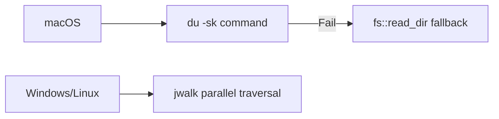

[← Visual](./visual.md) | [Index](./index.md)

# Size Calculation

Directory/file size calculation requirements.

---

## Overview

| Item | Decision |
|------|----------|
| **Timing** | Automatic on folder display (background) |
| **Target** | All child directories |
| **Strategy** | Platform-optimized, fastest available method |
| **Architecture** | Platform-specific modules via `#[cfg]` at build time |

---

## Platform Strategy



### macOS (Primary)

| Item | Value |
|------|-------|
| Method | `du -sk` command |
| Fallback | `fs::read_dir` recursive traversal |
| Threading | `std::thread::spawn` |

### Windows/Linux (Fallback)

| Item | Value |
|------|-------|
| Method | `jwalk::WalkDir` parallel traversal |
| Expected performance | 4x faster than walkdir |
| Dependency | `jwalk = "0.8"` |

---

## UI Behavior

### Display Flow


### Visual States

| State | Representation |
|-------|---------------|
| Calculating | **Pulse animation** (sin wave alpha, 2Hz) |
| Complete | Animation stops, correct size applied |
| Error | Animation stops, minimum size retained |

---

## Data Flow

```
1. Folder selected
   ↓
2. Check PersistentCache → HIT: use cached size, skip pulse
   ↓ (MISS)
3. spawn_celestials() → entities at min size + PulseAnimation
   ↓
4. spawn_size_calculations() → background thread
   ↓
5. crossbeam channel sends SizeResult
   ↓
6. update_celestial_sizes() → update entity + stop animation + cache write
```

---

## Components

| Component | Purpose |
|-----------|---------|
| `PendingSizeCalculation` | Marker: calculation in progress |
| `PulseAnimation` | Alpha animation state |

## Resources

| Resource | Purpose |
|----------|---------|
| `SizeCalculationChannel` | crossbeam bounded channel for results |
| `PersistentCache` | redb disk cache (TTL 3600s) |

---

## Performance Targets

| Platform | Scale | Target |
|----------|-------|--------|
| macOS (`du`) | 100,000 files | < 1s |
| Others (jwalk) | 100,000 files | < 5s |

---

## See Also

- [Visual Encoding](./visual.md) — Size → celestial body size mapping
- [Size Calculation Design](../design/size-calculation.md) — Implementation details
- [Persistent Cache Design](../design/persistent-cache.md) — Cache architecture
